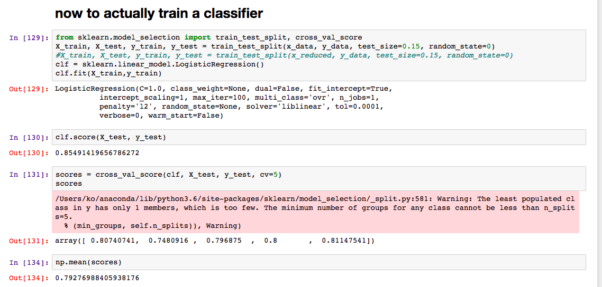

footer: TeamKernel, 2017

# moneybot

conversational interface to your finances

## by #teamkernel

---

# problem

## easily access and analyze my transactions

## know my spending habits

my bank and apps like pocketbook tdon't do a good enough job.

---

## know thy incoming data

---

# automated parsing

---

# transaction classification > 80%

---

# why does my bank suck at classifying my transactions?

features, features, features![^1]

- used word2vec and sklearn to classify
- turns out the big guys use yellow pages and humans
- we used a number of algos from sklearn

[^1]: ok, maybe not so many

---

# need NLP to understand text

- we're using facebook's wit.ai engine to parse text
- fb AI promises the world, but needs a lot of work [^fb]

---

# short demo

moneybot, where art thou?

---

# handle more intents in the future

### by using a LSTM NN to connect incoming intents to actions with memory

---

of course, a few years from now...

---

# [fit] questions?